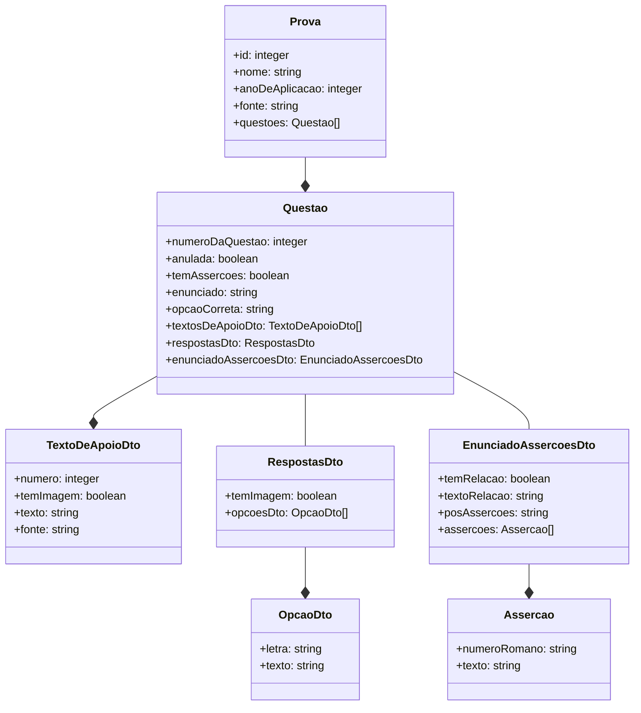

# ProvasAPI

Desafio de primeira API.

```mermaid
classDiagram

    class Prova {
  +id: integer
  +nome: string
  +anoDeAplicacao: integer
  +fonte: string
  +questoes: Questao[]
}

class Questao {
  +numeroDaQuestao: integer
  +anulada: boolean
  +temAssercoes: boolean
  +enunciado: string
  +opcaoCorreta: string
  +textosDeApoioDto: TextoDeApoioDto[]
  +respostasDto: RespostasDto
  +enunciadoAssercoesDto: EnunciadoAssercoesDto
}

class TextoDeApoioDto {
  +numero: integer
  +temImagem: boolean
  +texto: string
  +fonte: string
}

class RespostasDto {
  +temImagem: boolean
  +opcoesDto: OpcaoDto[]
}

class OpcaoDto {
  +letra: string
  +texto: string
}

class EnunciadoAssercoesDto {
  +temRelacao: boolean
  +textoRelacao: string
  +posAssercoes: string
  +assercoes: Assercao[]
}

class Assercao {
  +numeroRomano: string
  +texto: string
}

Prova --*  Questao 
 Questao  --* TextoDeApoioDto
Questao -- RespostasDto
RespostasDto --* OpcaoDto
Questao -- EnunciadoAssercoesDto
EnunciadoAssercoesDto --* Assercao
```
